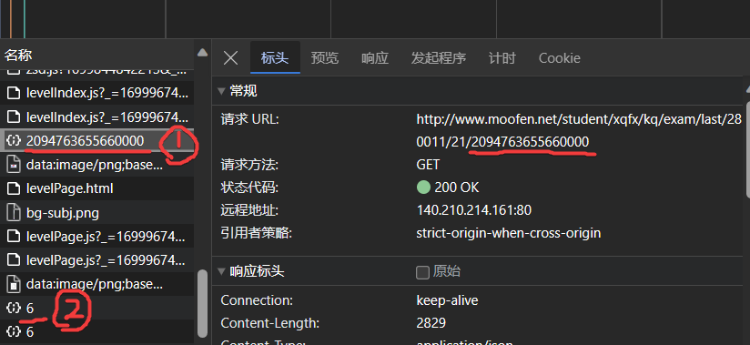

# 多分破解版

> Developed by 谭景元

## 注意

该工具仅限学习交流

## 准备工作
### Windows
版本不要太低，尽量10版及以上
无需准备，双击应用程序 `duofen` 即可使用
### Linux
考虑到技术用户使用，需要有适当的python环境 (开发时为3.9)
### Mac
自行适配环境，自行处理bug，自行配置环境
### 安卓
考虑退出
### IOS
考虑关机

## 首次使用
_仅限首次使用时，平时使用直接按下方 [日常使用](#日常使用) 内容操作即可_

_该内容仅需设置一次，个人的编码永久不会变化_

运行程序，打开程序设置

> 操作方法：按上下方向键移动，按回车(Enter)确认

在浏览器网址栏打开链接 [*http://www.moofen.net/student/*](http://www.moofen.net/student/)

> 先不要点登录按钮！

点击 `ctrl + shift + I` ( `F12` ), 出现 Devtool

点击 网络 ( Network ) 标签

在多分页面登录

如下图

在 Devtool 中 (一般在*靠后*) 找到项目名为一串数字(一般 `209...00` 的格式), 如图中位置 ①, 复制之

没有找到，可以在列表最后找到项目，名为一个数字, 如图位置 ②, 复制之

在程序中设置 `schStuCode`, 将数字输入, 配置成功

## 日常使用

打开浏览器

在浏览器网址栏打开链接 [*http://www.moofen.net/student/*](http://www.moofen.net/student/)

> 先不要点登录按钮！

点击 `ctrl + shift + I` ( `F12` ), 出现 Devtool, 点击 网络 ( Network ) 标签

在多分页面登录

> 前面步骤也可替换为 在已经登陆的页面
>
> 点击 `ctrl + shift + I` ( `F12` ) 打开devtool, 点击 网络 ( Network ) 标签
>
> 点击 `ctrl + R` 或点击浏览器的刷新按钮，刷新页面

找到开头第一项 `index.html`, 找到请求标头的 `Cookies` , 把 Cookie 后的内容 ***全部*** 复制下来

启动程序, 输入 `Cookies`, 即可使用, 注意cookies有一定时效性