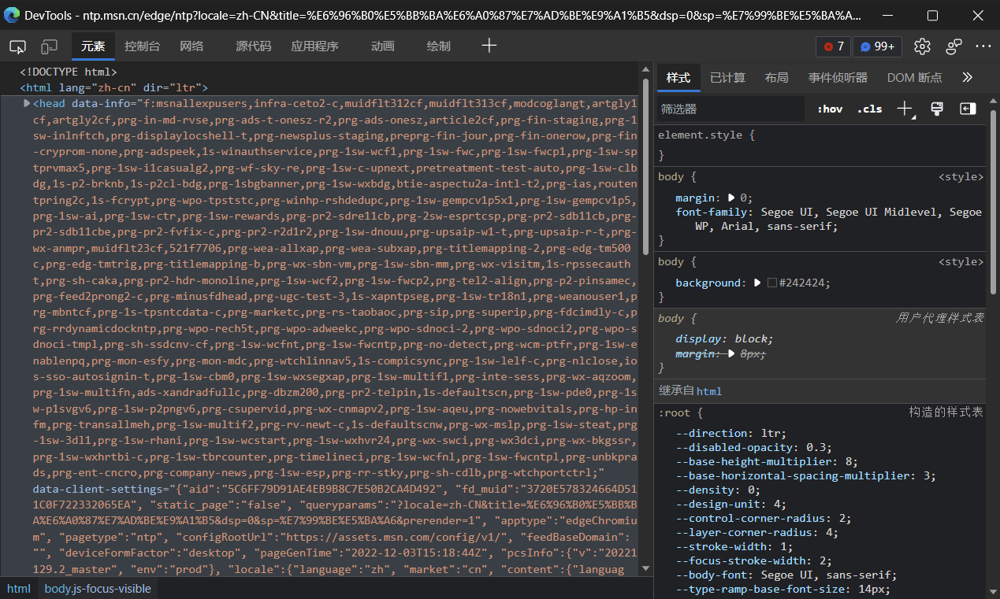
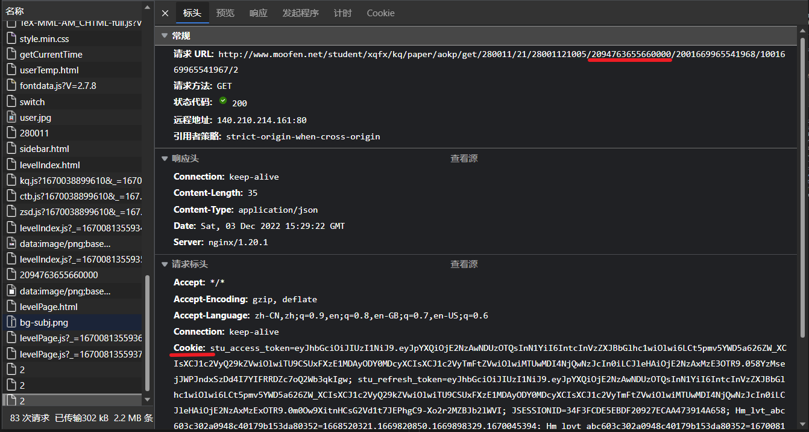

# 多分破解版

> Developed by 谭景元

欢迎使用多分破解版

## 注意

该工具仅限学习交流

## 条件

1. 尽量使用 Windows 10+ 系统
2. 有 Python 运行环境
3. 一些依赖库

## 使用

打开浏览器

在浏览器网址栏打开链接 [*http://www.moofen.net/student/*](http://www.moofen.net/student/)

> 先不要点登录按钮！

点击 `F12` ( `Fn + F12` ), 出现 Devtool

点击 网络 ( Network ) 标签

在页面登录

在 Devtool 中的 *最后* 找到项目名为一个数字(`1 / 2 / 3 或 4`), 找到如图的两个数据

第一个数据为 `schStuCode` , 可能与图片上不同，须找对位置

第二个数据为 `Cookies` , 把 Cookie 后的内容 ***全部*** 复制下来

运行程序, 按提示输入 `Cookies` 和 `schStuCode` , 即可使用
